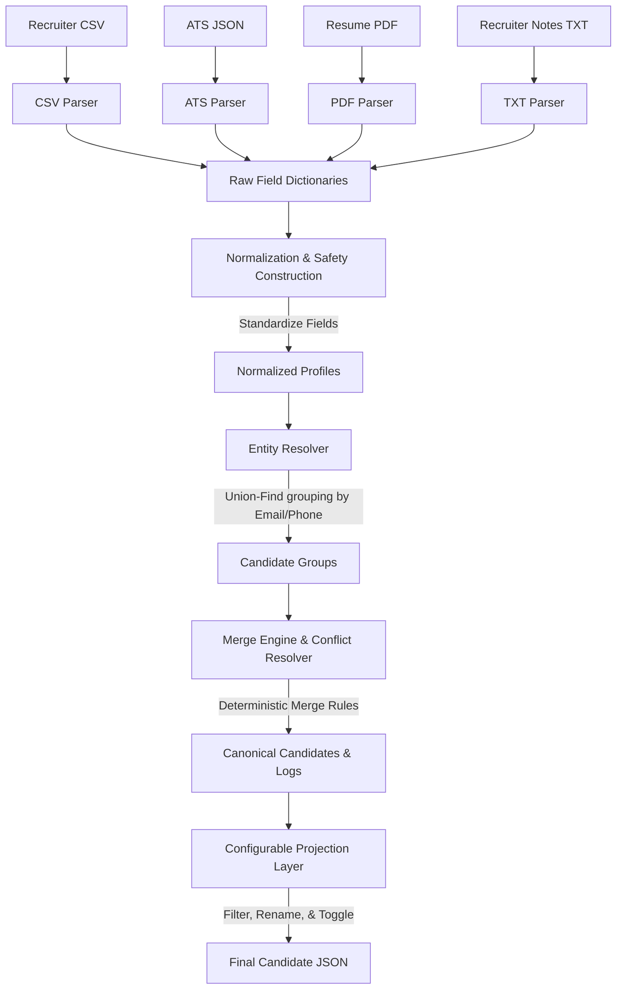

# Multi-Source Candidate Data Transformer

Production-grade candidate data ingestion pipeline built for the Eightfold Engineering Intern Assignment.

## Features

- Multi-source ingestion
- Entity resolution
- Conflict resolution
- Confidence scoring
- Provenance tracking
- Configurable projection layer
- CLI interface
- 17 passing tests


## 1. System Architecture

The project employs a decoupled, modular design where each module has a single responsibility.

### Folder Structure
```text
Eightfold/
├── configs/
│   ├── canonical_skills.json    # Synonym mapping vocabulary dictionary for skills
│   ├── projection_config.json   # Output schema filter, rename, and toggle rules
│   └── source_weights.json      # Dynamic source reliability weights
├── sample_inputs/
│   ├── recruiter.csv
│   ├── ats.json
│   ├── resume.pdf               # Compiled letter PDF resume
│   └── recruiter_notes.txt
├── src/
│   ├── main.py                  # CLI Orchestration pipeline (referenced by root main.py)
│   ├── parsers/
│   │   ├── base_parser.py       # Base abstract parser & safe model constructor
│   │   ├── csv_parser.py
│   │   ├── ats_parser.py
│   │   ├── pdf_resume_parser.py
│   │   └── txt_notes_parser.py
│   ├── normalizers/
│   │   ├── phone.py             # E.164 parsing via phonenumbers library
│   │   ├── skills.py            # Case-insensitive vocabulary matching
│   │   ├── dates.py             # YYYY-MM standardization via python-dateutil
│   │   ├── country.py           # ISO Alpha-2 mapping
│   │   └── company.py           # Corporate suffix cleanup & brand capitalization
│   ├── merger/
│   │   ├── entity_resolver.py   # Connected components cluster grouping & list merges
│   │   ├── conflict_resolver.py # Deterministic scalar resolver
│   │   └── confidence_engine.py # Configurable source weight calculations
│   ├── projection/
│   │   └── config_projection.py # Custom API formatter layer
│   ├── validation/
│   │   └── schema_validator.py  # Core Pydantic profile definitions
│   ├── provenance/
│   │   └── provenance_tracker.py# Audit logs compiler
│   └── utils/
│       ├── logger.py            # Console Rich logger and Warning/Error accumulator
│       └── constants.py
├── tests/                       # Complete pytest suite
├── scripts/
│   ├── generate_sample_pdf.py   # PDF compilation helper for testing
│   └── generate_design_pdf.py   # 1-page Design Document PDF compiler
├── main.py                      # Roots executable CLI entry point
├── README.md
└── requirements.txt
```

---

## 2. Ingestion Pipeline flow



---

## 3. Merge Strategy & Conflict Resolution Heuristics

When resolving values for a scalar candidate field (First Name, Last Name, Email, Phone), the conflict resolver applies these deterministic rules:
1. **Exact match:** If all active sources agree on the exact raw string.
2. **Normalized match:** If values match after normalization (e.g. `c plus plus` and `cpp` mapping to `C++`).
3. **Higher source reliability:** Chooses the value from the source with the highest reliability weight.
4. **Higher completeness:** If weights are equal, chooses the longest string (e.g. `Johnathan` over `John`).
5. **Latest employment end date:** If weights and lengths are equal, chooses the value associated with the source recording the latest employment end date (e.g. `Present` > `2024-06`).
6. **Fallback:** If all ties fail, falls back to alphabetical sorting or keeping multiple values.

For work experience, items are merged only if they represent the **same job** by sharing identical company, title, start date, and end date. If any of these fields differ (e.g., separate roles or separate timelines), they are preserved as unique employments and sorted descending by latest end date.

---

## 4. Mathematical Confidence Model

The confidence score $C$ for a merged field is calculated dynamically as:
$$C = \min(R_s \times N_s \times V_s \times A, 1.0)$$
Where:
* $R_s$: Source Reliability weight loaded from `configs/source_weights.json` (Defaults: Recruiter CSV = 0.95, ATS JSON = 0.90, Resume PDF = 0.80, Recruiter Notes = 0.60).
* $N_s$: Normalization Success factor (1.0 if successfully standardized, 0.7 if failed/defaulted).
* $V_s$: Validation Success factor (1.0 if passed Pydantic rules, 0.5 if failed).
* $A$: Agreement Multiplier. If $k$ sources agree on the selected value, $A = 1.0 + 0.05 \times (k-1)$.

---

## 5. Audit Trails & Logs (Data Lineage)

The pipeline exports a complete suite of logs to the output folder:
1. **`decision_log.json`**: An explainable registry for every merged field, recording raw competing values, normalized values, winning source, selected merge strategy, confidence score, and a human-readable reason.
2. **`candidate_timeline.json`**: A step-by-step trace of candidate data through the pipeline stages, capturing raw inputs, normalization formats, validation outcomes, and merge events.
3. **`quality_report.json`**: Structural metrics including duplicates removed, conflict counts, completeness percentages, validation failures, and an overall data quality score.
4. **`pipeline_summary.json`**: Global runtime statistics, warning listings, average confidence scores, and execution durations.

---

## 6. Configurable Projection Layer

The projection layer preserves the immutable canonical record. Custom target formats are generated using rules in `configs/projection_config.json`:
* `field_selection`: Filter specific fields (e.g. exclude URLs).
* `renaming`: Map canonical fields to custom API keys (e.g. `first_name` $\rightarrow$ `fname`).
* `normalization`: Apply post-processing string formats (e.g., lowercasing emails).
* `missing_policy`: Choose how to handle missing data (`fill_null`, `ignore` key, or `default_value` like `""` or `[]`).
* `confidence_toggle`: Include/exclude field confidence scores.
* `provenance_toggle`: Include/exclude source provenance details.

---

## 7. Run Instructions

### Prerequisites
Install requirements:
```bash
pip install -r requirements.txt
```
*(Or install `typer`, `rich`, `pymupdf`, `phonenumbers`, `reportlab`, `pandas`, `pydantic`, `python-dateutil` manually)*

### Run Ingestion
Execute the transformer via the CLI:
```bash
python main.py --csv sample_inputs/recruiter.csv --resume sample_inputs/resume.pdf --notes sample_inputs/recruiter_notes.txt --ats sample_inputs/ats.json --config configs/projection_config.json --output outputs/candidate.json
```

### Run PDF compiler
To compile the 1-page Design Document PDF:
```bash
python scripts/generate_design_pdf.py
```
*(Compiled output is generated at `outputs/design_document.pdf`)*

### Run Tests
To run the full unit test suite:
```bash
python -m pytest
```

---

## 8. Assumptions, Limitations & Future Improvements

### Assumptions
* Email and Phone are unique candidate keys for entity grouping.
* Standard ISO Alpha-2 codes are expected for countries. We map common US state abbreviations (e.g. `CA`, `NY`) to `US` for convenience.

### Limitations
* PDF text extraction relies on standard text layers. Scanned resumes would require an OCR layer (e.g., Tesseract).
* Graph connected-components groupings are kept in memory. This is highly performant for batch CLI runs but would need an external database index for millions of records.

### Future Improvements
* **Distributed Processing:** Port the parsing and grouping logic to Apache Spark or Ray for distributed ingestion.
* **LLM Entity Parsing:** Integrate a lightweight local LLM parser (e.g., llama.cpp) as an alternate unstructured text parser fallback for extremely messy resumes.
